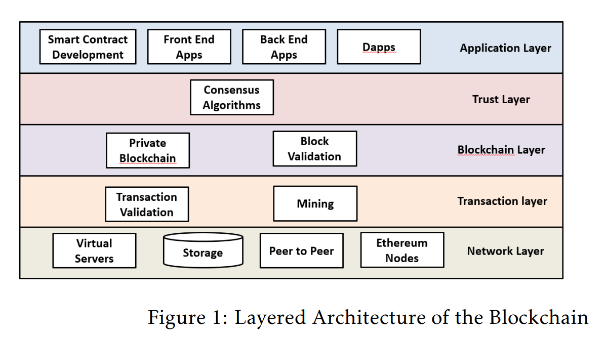
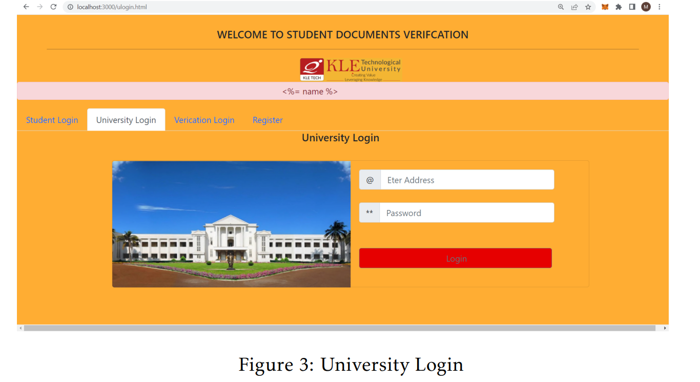
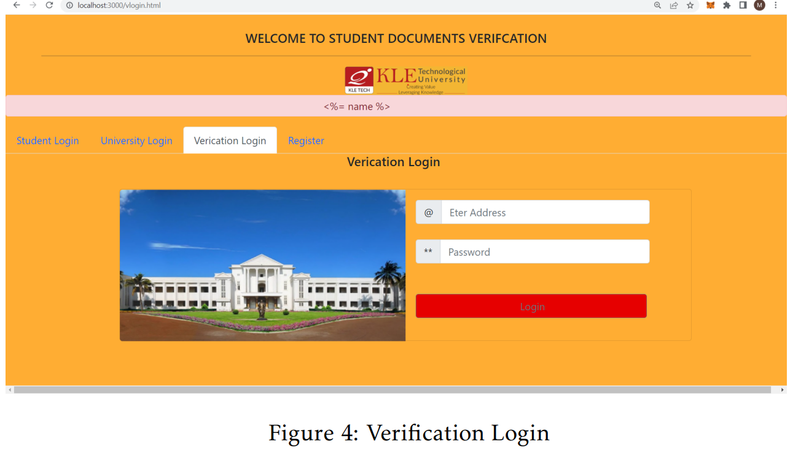
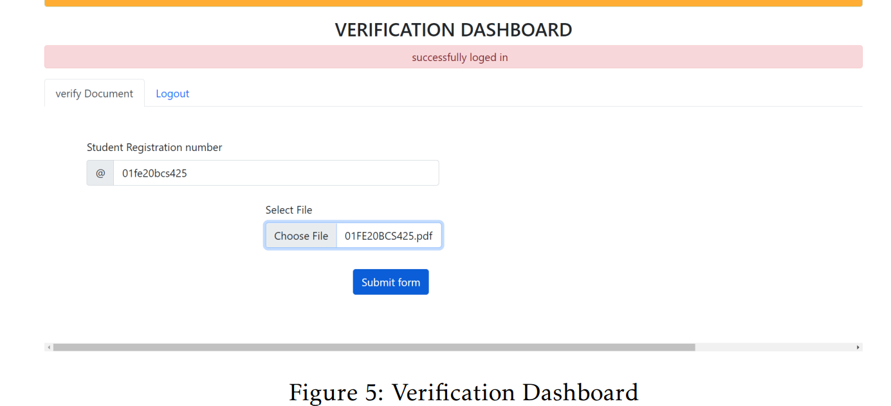
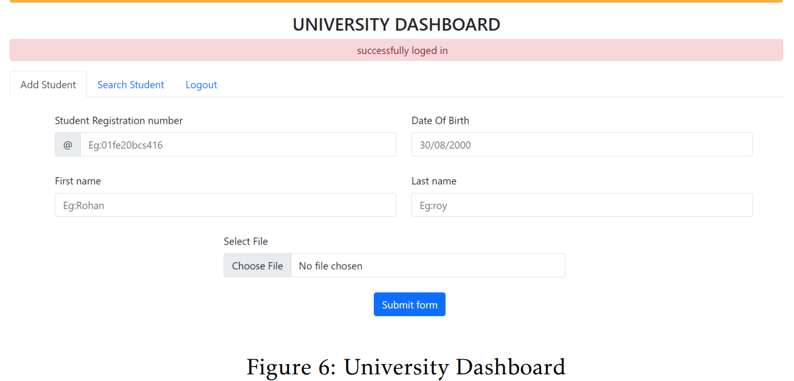
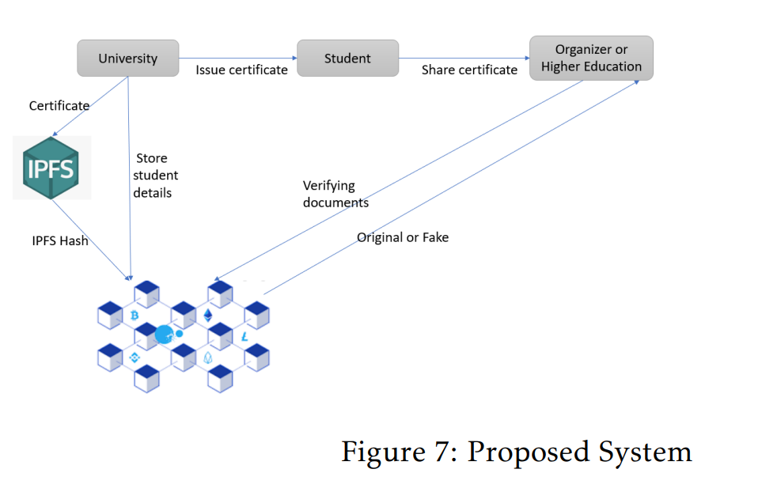
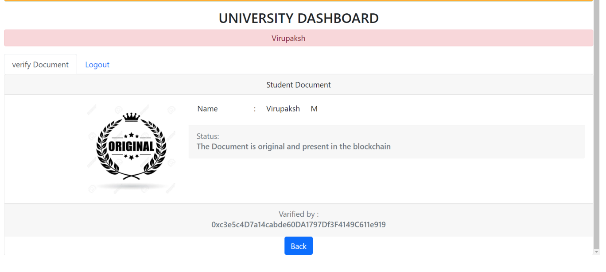
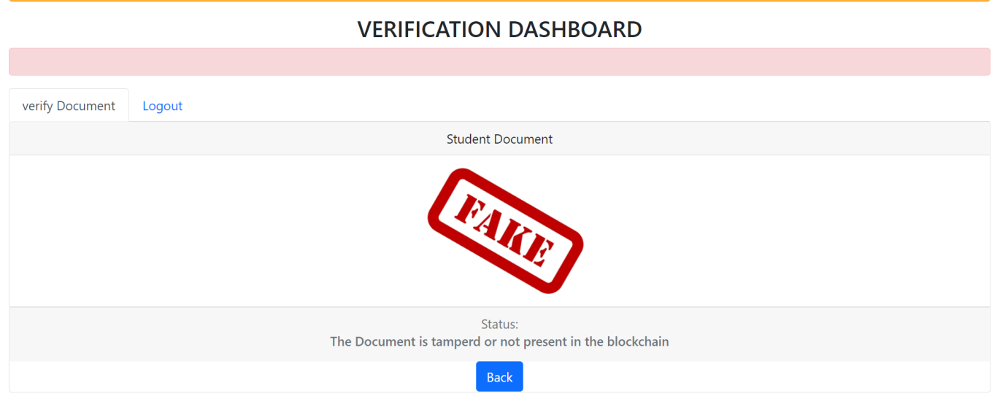

# DIGITAL-CERTIFICATE-VALIDATION-SYSTEM-USING-BLOCKCHAIN-TECHNOLOGY

* For detailed explaination of project refer to Project.pdf

* Scalable Blockchain Architecture using Off-Chain IPFS for Marks Card Validation. Published our paper in 4th International Conference on Innovative Data Communication Technologies and Application (ICIDCA 2022).

Link to paper - https://www.sciencedirect.com/science/article/pii/S187705092202110X

## University Login

## Verification Login

## Verification Dashboard

## University Dasboard

## Proposed System

Figure 7 shows the proposed blockchain architecture integrated with the IPFS network. In the traditional approach marks card were stored manually in the centralized storage system. We utilized blockchain technology in the proposed methodology to store and manage marks cards and certificates in the decentralized storage. Blockchain is a shared database that differs from regular databases in storing data. Data is saved on the Blockchain in blocks linked together using cryptographic principles. The Blockchain’s goal is to enable the recording and distribution of digital data without the ability to change it; Blockchain is immutable ledgers or transaction records that cannot be modified or deleted. Marks card validation system; we use the Blockchain’s main features, such as immutable ledger, traceability, distributed ledger, privacy, and security. Based on student information, we propose mark cards in pdf format. Latency is a phenomenon that makes storing pdf on the blockchain challenge. The most cost-effective technique is to save the entire pdf into an IPFS file and put it on the blockchain ledger. In the proposed marks card validation system, we’re integrating an IPFS client for storing student marks cards, and the marks card’s address will be kept on the IPFS blockchain. SHA 256 cryptographic hash function is used to generate the hash value and is stored in the blockchain ledger. This hash value is used to determine the authenticity of the marks cards. The SHA 256 algorithm is a cryptographic idea for converting sensitive reading information into an unreadable format. The string’s arbitrary length is converted to a fixed-length hash value using this SHA 256 hash function.

## Certificate Verification

 
 
 ## Certificate Rejected

